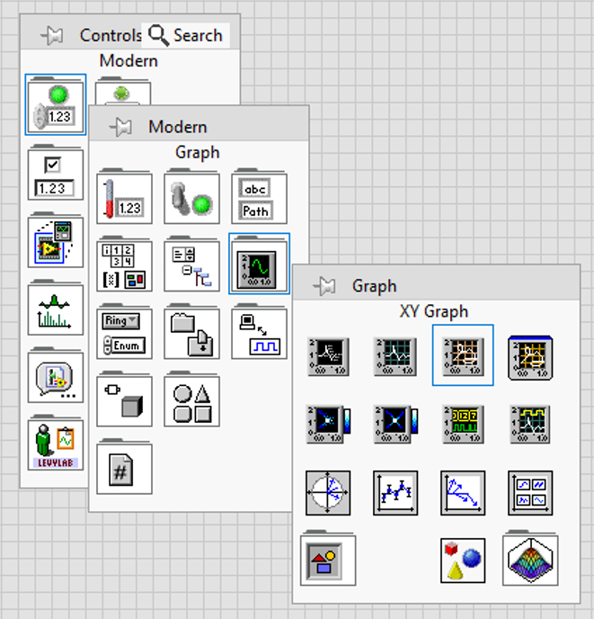
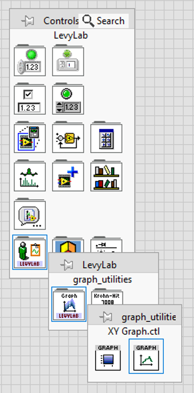
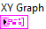
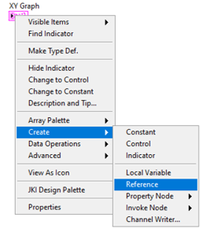
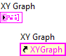
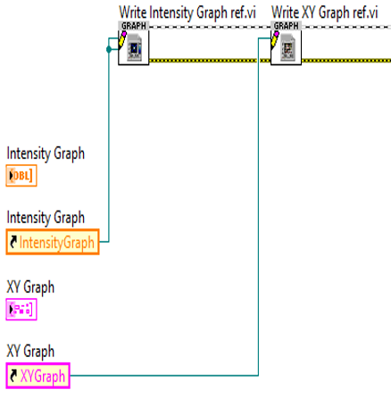
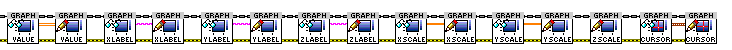
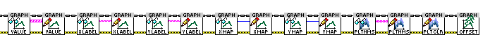
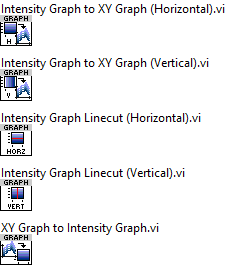
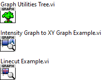

# Graph Utilities
Utilities for working with XY graphs and Intensity graphs in LabVIEW. 

- VIs are contained in the class graph_utilities.lvclass
- Many low level VIs are basically wrappers for property nodes to modify, for example, graph labels.
- High level VIs will convert back and forth between Intensity Graphs and XY Graphs. Note: these operate directly on the graph object _by reference_
- Also functions are provided to take linecuts of an Intensity Graph with a defined width

## Installation
Download and install using the VI Package Manager as described [here](https://levylabpitt.github.io/)

## Getting Started
### Creating a graph reference
- Drop a graph control onto the front panel

- Right click on the graph and choose “Create: Reference”

- Now you have a graph reference

### Call “Write Intensity Graph.vi” and “Write XY Graph.vi” to put the graph reference onto the Graph Utilities class wire
- Write Intensity Graph ref.vi: Write control references to the class wire.
  - "Intensity Graph" is the normal target for reading and writing.
  - "Intensity Graph (Control)" is only used to read the cursor position of the "Control" Intensity Graph.

- Write XY Graph ref.vi: Write control references to the class wire.
  - "XY Graph" is the normal target for reading and writing.
  - "XY Graph (Control)" is reserved for future use.

## Usage
### /Intensity Graph/
Primitives for working with Intensity Graphs.

### /XY Graph/
Primitives for working with XY Graphs.

### /API/
Higher-Level VIs. For example: convert an Intensity Graph into a family of plots on an XY Graph. And vice versa. Also easily take Linecuts with width on an Intensity Graph.

### /subVIs/
helper VIs

## Examples
- Intensity Graph to XY Graph Example.vi: Stand alone VI for converting an Intensity Graph in XY plots. Converts both horizontally and vertically.
- Linecut Example.vi: Stand alone VI for taking linecuts of an Intensity Graph. This VI uses one Intensity Graph as a cursor control and another Intensity Graph as a cursor target

## Contributing
Please contact [Patrick Irvin](p.irvin@levylab.org)

## License
[BSD-3](https://opensource.org/licenses/BSD-3-Clause)
